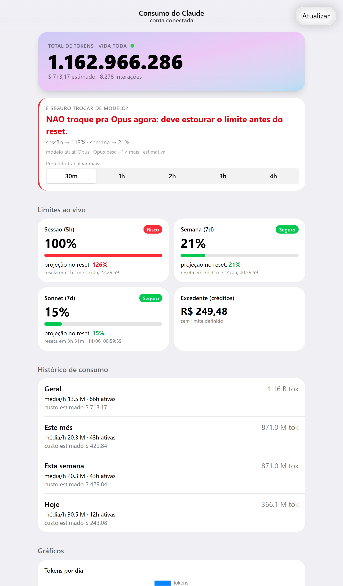
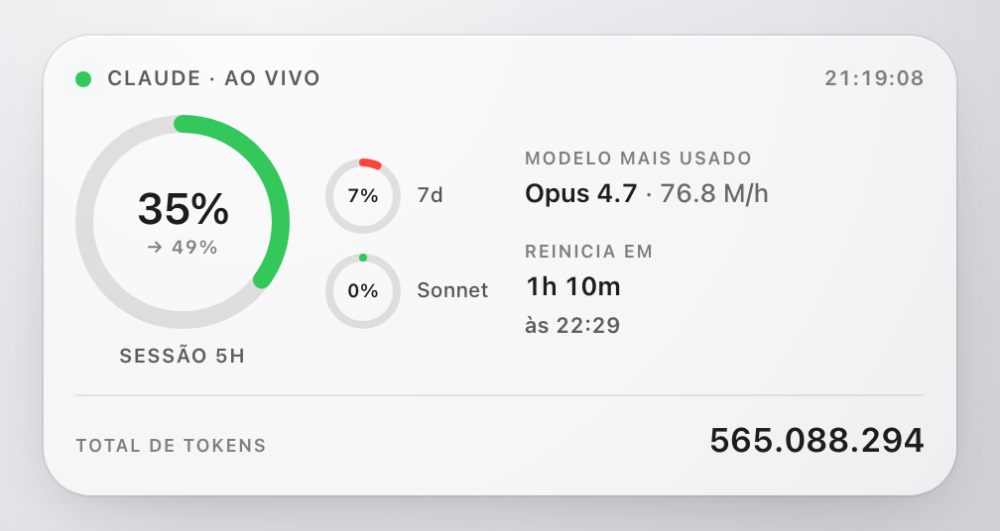

# Painel de Consumo do Claude

Um painel local que mostra, em um só lugar, **quanto você já consumiu** no Claude
Code e **se é seguro continuar / trocar de modelo agora** — ou se você corre o
risco de bater o limite no meio de um projeto.



Ele junta duas fontes:

1. **Seus logs locais** (`~/.claude/projects`) → total de tokens da vida toda,
   médias por hora (geral / mês / semana / dia), custo estimado e ritmo de
   consumo por modelo.
2. **A API de uso da sua conta** (`/api/oauth/usage`) → % usada da **sessão (5h)**,
   da **semana (7d)** e do bucket de **Sonnet (7d)**, horários de reset e créditos
   de excedente.

Com isso, mostra um **semáforo por janela** e um **veredito direto**: *"dá pra
trocar pra Opus agora ou vou estourar antes de terminar?"*.

> ⚠️ **Projeto não-oficial.** Não tem relação com a Anthropic. Ele lê um endpoint
> de uso que não é documentado publicamente e pode mudar a qualquer momento.
> Use por sua conta e risco.

## Recursos

- 🔢 **Total absoluto de tokens da vida toda**, atualizando quase em tempo real.
- 🚦 **Semáforo por janela** (verde < 80% projetado · amarelo 80–100% · vermelho ≥ 100%).
- 🔮 **Projeção até o reset** com base no ritmo medido de consumo.
- 🤖 **Veredito de troca de modelo** combinando limite ao vivo + ritmo dos logs.
- 📊 Gráficos de tokens por dia, perfil por hora do dia e evolução das janelas.
- ⏱️ Intervalo de atualização configurável.
- 🍎 **Interface no estilo iOS** feita com [Konsta UI](https://konstaui.com) + Tailwind CSS v4.
- 🪟 **Widget flutuante nativo** para macOS, Windows e Linux (sempre no topo) — veja [App de desktop](#app-de-desktop-macos-windows-e-linux).
- 🔒 Roda 100% local; nenhum dado sai da sua máquina.

## Stack

- **Frontend:** React + Vite + Konsta UI (tema iOS) + Tailwind CSS v4 + Chart.js. Componentes documentados no **Storybook**.
- **Backend:** Python (só biblioteca padrão) — serve o build do frontend e expõe a API de estado/uso.
- **App de desktop (macOS/Windows/Linux):** [Tauri](https://tauri.app) (Rust) — janela flutuante nativa que exibe o widget. Veja a seção [App de desktop](#app-de-desktop-macos-windows-e-linux).

## Requisitos

Para **rodar** (a interface já vem compilada em `web/dist`):

- **Python 3.8+** (só biblioteca padrão).
- **Claude Code** já autenticado na máquina (CLI ou app).
- Conexão com internet (para a API de uso da conta).

Para **desenvolver a interface** (opcional): **Node.js 18+**.

## Instalação

```bash
git clone https://github.com/eueduardocampos/claude-usage
cd claude-usage
python main.py
```

Por padrão, o painel sobe em **http://localhost:8090** e abre sozinho no navegador.

Dois detalhes importantes:

- `localhost` é **a sua própria máquina**. Cada pessoa roda a sua instância, com os
  próprios dados e a própria conta. Não é um endereço público nem compartilhado, e
  ninguém de fora acessa o seu painel.
- A porta (`8090`) e o abrir-sozinho são configuráveis em `config.json`
  (`port` e `open_browser`). Se a porta já estiver em uso, troque por outra.

No Windows você também pode dar dois cliques em `iniciar-painel.bat`.

## App de desktop (macOS, Windows e Linux)

Além do painel completo no navegador, existe um **widget flutuante nativo** — uma
janelinha sempre visível, no estilo dos widgets do sistema, que mostra o essencial
em tempo real e fica por cima das outras janelas enquanto você trabalha. Tem build
para **macOS, Windows e Linux**.



O que ele traz:

- **Janela flutuante** sem barra de título, que você arrasta e fixa em qualquer
  lugar da tela.
- **Vidro translúcido** com um **regulador de transparência** (passe o mouse sobre
  o widget e use o controle deslizante). No macOS o desktop aparece borrado por
  baixo (Liquid Glass); no Windows usa Mica nativo; no Linux fica translúcido sem
  o blur.
- **Sempre no topo**, com atualização a cada 5s.
- **Anel principal da janela de 5h** (a que realmente trava o uso), anéis menores
  para o semanal e o Sonnet, modelo mais usado na sessão, quando a janela
  reinicia e o total de tokens dígito a dígito.
- **Ícone na bandeja/barra de menu**: clique para mostrar/ocultar, alternar
  "sempre no topo" ou sair.

> O app de desktop é só a "moldura" nativa: ele exibe o widget servido pelo
> backend em `localhost:8090`. **O painel (`python main.py`) precisa estar
> rodando** para o app mostrar dados — vale para os três sistemas.

### Instalar pelo release (sem ferramentas de build)

1. Deixe o painel rodando: `python main.py`.
2. Baixe o instalador do seu sistema na [página de releases](https://github.com/eueduardocampos/claude-usage/releases):
   - **macOS:** `.dmg` (universal — Intel e Apple Silicon). Abra e arraste o app
     para Aplicativos. Na primeira vez, clique com o botão direito → **Abrir**
     (o app não é assinado pela Apple).
   - **Windows:** `.msi` ou `.exe`. Se o SmartScreen avisar, clique em **Mais
     informações → Executar assim mesmo**.
   - **Linux:** `.AppImage` (dê permissão de execução e rode), `.deb` (Debian/
     Ubuntu) ou `.rpm` (Fedora/openSUSE).

### Rodar a partir do código

Precisa do [Rust](https://rustup.rs) instalado (`rustup`). Com o painel rodando:

```bash
cd desktop
npx @tauri-apps/cli dev      # abre o widget em modo desenvolvimento
npx @tauri-apps/cli build    # gera o instalador em src-tauri/target/release/bundle
```

Os releases multiplataforma são gerados automaticamente pelo GitHub Actions
(`.github/workflows/release.yml`) a cada tag `v*`, em runners nativos de cada
sistema.

### Ícone do app

O ícone atual é um placeholder. Para trocar pela arte definitiva, coloque um PNG
quadrado (≥ 1024px) e rode, dentro de `desktop/`:

```bash
npx @tauri-apps/cli icon caminho/para/arte.png
```

### iOS

Uma versão para **iPhone/iPad** está no radar para o futuro. O backend e a
interface já são compartilhados, então o caminho é levar o mesmo widget para um
app iOS — ainda sem data definida.

## Desenvolvimento da interface

A interface fica em `web/` (React + Vite + Konsta UI). O build versionado em
`web/dist` é o que o `python main.py` serve — por isso quem só quer **usar** não
precisa de Node. Para **mexer na interface**:

```bash
cd web
npm install
npm run dev          # Vite em http://localhost:5173 (com a API do Python via proxy)
npm run build        # regera web/dist (rode antes de commitar mudanças de UI)
npm run storybook    # Storybook dos componentes em http://localhost:6006
```

No `npm run dev`, deixe o backend rodando em paralelo (`python main.py`) para a
API responder.

## Autenticação

Na primeira execução o painel tenta reaproveitar a credencial do Claude Code
(`~/.claude/.credentials.json`). Se ela não servir, clique em **"Reconectar conta"**
no painel (ou rode `python auth.py login`): abre uma aba no navegador para você
autorizar via OAuth. O token fica salvo localmente em `token.json` e é renovado
automaticamente — **independente do Claude Desktop**.

## Como funciona o alerta

- **Projeção:** usa a velocidade medida (%/hora) quando há amostras suficientes
  (≥ 30 min de coleta); antes disso, usa a média desde a abertura da janela.
- **Veredito de troca:** se a conta não expõe um bucket separado de Opus, o Opus
  é avaliado pelo impacto na sessão (5h) e no semanal geral (7d), aplicando um
  fator de intensidade. É uma **estimativa** e fica mais precisa conforme o painel
  coleta amostras.

## Configuração

Copie `config.example.json` para `config.json` e ajuste o que quiser:

| Campo | Descrição |
|---|---|
| `port` | Porta do painel (padrão 8090) |
| `refresh_seconds` | Intervalo de atualização da API |
| `currency` | Moeda do excedente (ex.: `BRL`, `USD`) |
| `credits_divisor` | Divisor dos créditos (a API costuma vir em centavos → 100) |
| `intended_hours` | Horizonte padrão do veredito de troca |
| `callback_port` | Porta do callback do login OAuth |

## Privacidade e segurança

- Tudo roda em `localhost`. Os custos em USD são **estimativa** pela tabela de
  preço da API; em assinatura, o que é cobrado é o excedente mostrado no painel.
- `token.json` guarda o token OAuth da sua conta. Ele está no `.gitignore` e
  **nunca** deve ser compartilhado nem versionado.

## Contribuições

Este é um **projeto pessoal** e **não aceita contribuições externas**. Pull
requests de terceiros são fechados automaticamente. Fique à vontade para **usar,
clonar e dar fork** e adaptar para o seu uso.

## Licença

[MIT](LICENSE) © 2026 Eduardo Campos
