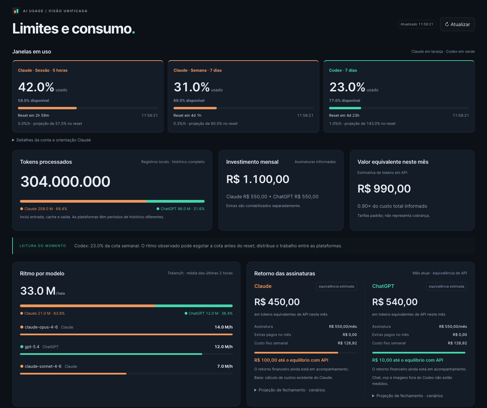
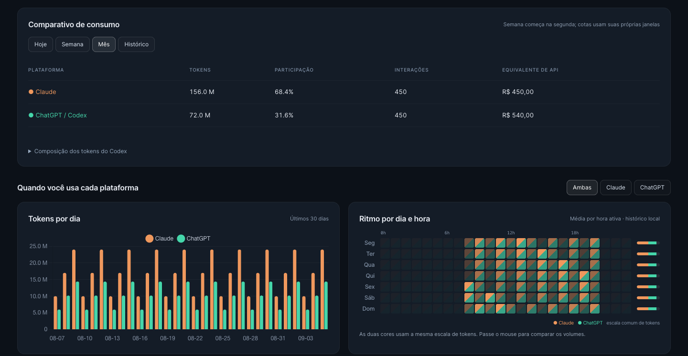
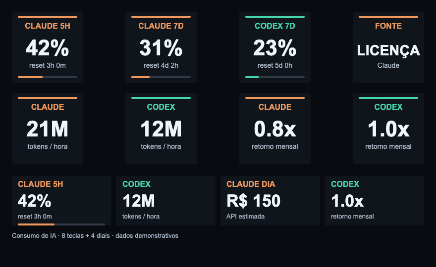
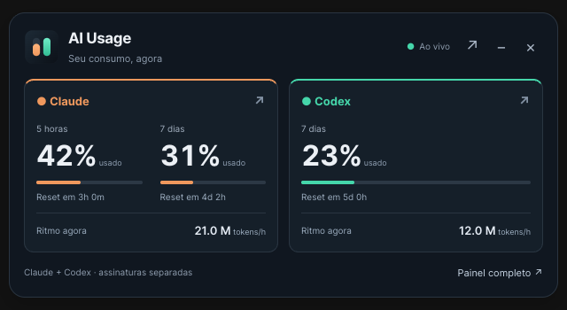

# Painel de Consumo de IA

Um painel local que acompanha separadamente a assinatura Claude e a assinatura
ChatGPT usada pelo Codex. No Claude, ele também mostra **se é seguro continuar /
trocar de modelo agora** — ou se você corre o risco de bater o limite no meio de
um projeto.

## Sobre

Claude e Codex no mesmo painel: cotas em uso no topo, tokens separados por
plataforma, ritmo por modelo e comparação do consumo com o custo das assinaturas.
No Stream Deck +, o perfil **Consumo de IA** reúne oito teclas e quatro dials
com números grandes, rótulos curtos e cores consistentes.



*Interface atual com dados demonstrativos. Cada instalação consulta suas próprias contas.*



*Claude em laranja e Codex em verde, na mesma escala de tokens.*



*Prévia renderizada das oito teclas e quatro dials; valores demonstrativos.*

## Fontes de dados

Ele junta duas fontes:

1. **Seus logs locais** (`~/.claude/projects`) → total de tokens da vida toda,
   médias por hora (geral / mês / semana / dia), custo estimado e ritmo de
   consumo por modelo.
2. **A API de uso da sua conta** (`/api/oauth/usage`) → % usada da **sessão (5h)**,
   da **semana (7d)** e do bucket de **Sonnet (7d)**, horários de reset e créditos
   de excedente.

Quando o Codex Desktop ou CLI está instalado, o painel também cria uma área
integrada para a **assinatura ChatGPT usada pelo Codex**. Os tokens são lidos de
`~/.codex/sessions`. A cota é consultada a cada cinco minutos usando o OAuth
existente em `~/.codex/auth.json`, sem copiar ou renovar credenciais. Snapshots
são guardados na tabela `codex_limits` do banco local por 90 dias.

O dashboard compara as plataformas com cores consistentes (Claude laranja,
ChatGPT verde), ritmo por modelo, cotas, histórico e equivalência de API.
A mensalidade é configurável, assim como compras extras no mês. Créditos não
são convertidos automaticamente em dinheiro. O cálculo de equivalência usa
preços padrão de texto verificados em 05/09/2026 e separa modelos sem preço.
Raciocínio já está incluído na saída; cache lido é cobrado separadamente da
entrada nova. Ferramentas, Fast e cache writes não registrados são excluídos.
Projeções de cota exigem 30 minutos na mesma janela; projeções financeiras
exigem três dias observados. Não há inferência de capacidade total por tokens.

Chat comum, imagens, voz e uploads não entram nesta medição.

Sessões importadas do Claude para o Codex são reconhecidas por
`~/.codex/external_agent_session_imports.json`. O histórico importado continua
contabilizado no Claude; se a conversa for retomada no Codex, apenas as novas
chamadas OpenAI entram na área ChatGPT.

Com isso, mostra um **semáforo por janela** e um **veredito direto**: *"dá pra
trocar pra Opus agora ou vou estourar antes de terminar?"*.

> ⚠️ **Projeto não-oficial.** Não tem relação com a Anthropic, a OpenAI ou a Elgato. Ele lê um endpoint
> de uso que não é documentado publicamente e pode mudar a qualquer momento.
> Use por sua conta e risco.

## Recursos

- 🔢 **Total absoluto de tokens da vida toda**, atualizando quase em tempo real.
- 🧾 **Licença vs consumo**: detecta seu plano pela API (Pro, Max, Time, Enterprise), compara o que você paga (tabela Brasil) com o consumo equivalente em preço de API e mostra se está compensando.
- 🔥 **Fonte dos tokens ao vivo**: dentro da licença ou queimando créditos extras — com gasto das últimas 24h e média por hora dos extras.
- 🚦 **Semáforo por janela** (verde < 80% projetado · amarelo 80–100% · vermelho ≥ 100%).
- 🔮 **Projeção até o reset** com base no ritmo medido de consumo.
- 🤖 **Veredito de troca de modelo** combinando limite ao vivo + ritmo dos logs.
- 📊 Gráficos de tokens por dia, perfil por hora do dia e evolução das janelas.
- ⏱️ **Ritmo adaptativo e seguro**: lê a API a cada 90s perto do limite e a cada 5 min com folga, com backoff em `429` e sem tratar limite de requisição como desconexão.
- 🖥️ **Interface unificada e responsiva**: cotas ativas em uma faixa, janelas zeradas recolhidas e cores por plataforma.
- 🪟 **Widget flutuante nativo** para macOS, Windows e Linux (sempre no topo) — veja [App de desktop](#app-de-desktop-macos-windows-e-linux).
- 🔒 Histórico armazenado localmente; consultas autenticadas vão aos serviços de cada conta.

## Stack

- **Frontend:** React + Vite + Konsta UI (tema iOS) + Tailwind CSS v4 + Chart.js. Componentes documentados no **Storybook**.
- **Backend:** Python (só biblioteca padrão) — serve o build do frontend e expõe a API de estado/uso.
- **App de desktop (macOS/Windows/Linux):** [Tauri](https://tauri.app) (Rust) — janela flutuante nativa que exibe o widget. Veja a seção [App de desktop](#app-de-desktop-macos-windows-e-linux).

## Requisitos

Para **rodar** (a interface já vem compilada em `web/dist`):

- **Python 3.9+** (só biblioteca padrão). O macOS já traz 3.9 de fábrica, então
  serve sem instalar nada.
- **Claude Code e/ou Codex** já autenticados na máquina (CLI ou app).
- Conexão com internet (para a API de uso da conta).

Para **desenvolver a interface** (opcional): **Node.js 18+**.

## Instalação

```bash
git clone https://github.com/eueduardocampos/claude-usage
cd claude-usage
python main.py     # macOS/Linux: python3 main.py
```

Por padrão, o painel sobe em **http://localhost:8090** e abre sozinho no navegador.

Dois detalhes importantes:

- `localhost` é **a sua própria máquina**. Cada pessoa roda a sua instância, com os
  próprios dados e a própria conta. Não é um endereço público nem compartilhado, e
  ninguém de fora acessa o seu painel.
- A porta (`8090`) e o abrir-sozinho são configuráveis em `config.json`
  (`port` e `open_browser`). Se a porta já estiver em uso, troque por outra.

Você também pode dar dois cliques num lançador, sem abrir terminal:
`iniciar-painel.bat` no Windows, `iniciar-painel.command` no macOS. Para
reconectar a conta, os equivalentes são `reconectar-conta.bat` /
`reconectar-conta.command`.

> 🍎 No macOS, o Gatekeeper barra o primeiro duplo-clique num `.command` baixado
> da internet. Libere com **botão direito → Abrir** uma vez, ou rode
> `xattr -d com.apple.quarantine iniciar-painel.command`.

> 💾 O banco local (`painel.db`) fica em `%LOCALAPPDATA%\claude-usage\` no Windows
> (ou `~/.local/share/claude-usage/` no macOS/Linux) e é migrado automaticamente
> na primeira execução. Rodar o banco em disco local é o que mantém a API
> respondendo em milissegundos mesmo com o código num drive sincronizado.

## App de desktop (macOS, Windows e Linux)

Além do painel completo no navegador, existe um **widget flutuante nativo** — uma
janelinha sempre visível, no estilo dos widgets do sistema, que mostra o essencial
em tempo real e fica por cima das outras janelas enquanto você trabalha. Tem build
para **macOS, Windows e Linux**.



O que ele traz:

- **Janela flutuante** sem barra de título, que você arrasta e fixa em qualquer
  lugar da tela.
- **Vidro translúcido** com um **regulador de transparência** (passe o mouse sobre
  o widget e use o controle deslizante). No macOS o desktop aparece borrado por
  baixo (Liquid Glass); no Windows usa Mica nativo; no Linux fica translúcido sem
  o blur.
- **Sempre no topo**, com atualização a cada 5s.
- **Anel principal da janela de 5h** (a que realmente trava o uso), anéis menores
  para o semanal e o Sonnet, modelo mais usado na sessão, quando a janela
  reinicia e o total de tokens dígito a dígito.
- **Ícone na bandeja/barra de menu**: clique para mostrar/ocultar, alternar
  "sempre no topo" ou sair.

> O app de desktop é só a "moldura" nativa: ele exibe o widget servido pelo
> backend em `localhost:8090`. **O painel (`python main.py`) precisa estar
> rodando** para o app mostrar dados — vale para os três sistemas.

### Instalar pelo release (sem ferramentas de build)

1. Deixe o painel rodando: `python main.py`.
2. Baixe o instalador do seu sistema na [página de releases](https://github.com/eueduardocampos/claude-usage/releases):
   - **macOS:** `.dmg` (universal — Intel e Apple Silicon). Abra e arraste o app
     para Aplicativos. Na primeira vez, clique com o botão direito → **Abrir**
     (o app não é assinado pela Apple).
   - **Windows:** `.msi` ou `.exe`. Se o SmartScreen avisar, clique em **Mais
     informações → Executar assim mesmo**.
   - **Linux:** `.AppImage` (dê permissão de execução e rode), `.deb` (Debian/
     Ubuntu) ou `.rpm` (Fedora/openSUSE).

### Rodar a partir do código

Precisa do [Rust](https://rustup.rs) instalado (`rustup`). Com o painel rodando:

```bash
cd desktop
npx @tauri-apps/cli dev      # abre o widget em modo desenvolvimento
npx @tauri-apps/cli build    # gera o instalador em src-tauri/target/release/bundle
```

Os releases multiplataforma são gerados automaticamente pelo GitHub Actions
(`.github/workflows/release.yml`) a cada tag `v*`, em runners nativos de cada
sistema.

### Ícone do app

O ícone atual é um placeholder. Para trocar pela arte definitiva, coloque um PNG
quadrado (≥ 1024px) e rode, dentro de `desktop/`:

```bash
npx @tauri-apps/cli icon caminho/para/arte.png
```

## Stream Deck

O plugin **AI Usage 4.1** acompanha Claude e Codex com o perfil diário
**Consumo de IA** para Stream Deck +. Cotas e cobrança na primeira linha;
ritmo e retorno mensal na segunda. Os dials alternam janelas, modelos,
equivalência de API e totais. As ações e os perfis anteriores continuam disponíveis.

Baixe o [perfil Consumo de IA](streamdeck/Consumo%20de%20IA.streamDeckProfile)
e siga a [instalação do plugin](streamdeck/README.md#instalar).

### iOS

Uma versão para **iPhone/iPad** está no radar para o futuro. O backend e a
interface já são compartilhados, então o caminho é levar o mesmo widget para um
app iOS — ainda sem data definida.

## Desenvolvimento da interface

A interface fica em `web/` (React + Vite + Konsta UI). O build versionado em
`web/dist` é o que o `python main.py` serve — por isso quem só quer **usar** não
precisa de Node. Para **mexer na interface**:

```bash
cd web
npm install
npm run dev          # Vite em http://localhost:5173 (com a API do Python via proxy)
npm run build        # regera web/dist (rode antes de commitar mudanças de UI)
npm run storybook    # Storybook dos componentes em http://localhost:6006
```

No `npm run dev`, deixe o backend rodando em paralelo (`python main.py`) para a
API responder.

## Autenticação

Na primeira execução o painel tenta reaproveitar a credencial do Claude Code
(`~/.claude/.credentials.json`). Se ela não servir, clique em **"Reconectar conta"**
no painel (ou rode `python auth.py login`): abre uma aba no navegador para você
autorizar via OAuth. O token fica salvo localmente em `token.json` e é renovado
automaticamente — **independente do Claude Desktop**.

## Como funciona o alerta

- **Projeção:** usa a velocidade medida (%/hora) quando há amostras suficientes
  (≥ 30 min de coleta); antes disso, usa a média desde a abertura da janela.
- **Veredito de troca:** se a conta não expõe um bucket separado de Opus, o Opus
  é avaliado pelo impacto na sessão (5h) e no semanal geral (7d), aplicando um
  fator de intensidade. É uma **estimativa** e fica mais precisa conforme o painel
  coleta amostras.

## Configuração

Copie `config.example.json` para `config.json` e ajuste o que quiser:

| Campo | Descrição |
|---|---|
| `port` | Porta do painel (padrão 8090) |
| ~~`refresh_seconds`~~ | Não é mais configurável: o ritmo do poll é adaptativo (veja abaixo) |
| `currency` | Moeda do excedente (ex.: `BRL`, `USD`) |
| `credits_divisor` | Divisor dos créditos (a API costuma vir em centavos → 100) |
| `intended_hours` | Horizonte padrão do veredito de troca |
| `callback_port` | Porta do callback do login OAuth |

## Por que o intervalo da API é fixo

O limite de requisições vale para a **conta inteira** — cada sessão aberta do
Claude Code soma no mesmo balde. Um intervalo curto no painel não traz
informação nova (as janelas de uso se movem devagar) e ainda ajuda a estourar o
limite. Por isso o poll tem **ritmo adaptativo** — 90s quando alguma janela passa de
80% (a faixa em que 1 ponto muda decisão), 3 min entre 50–80% e 5 min com folga.
E quando vem um `429` o painel:

- **não** marca a conta como desconectada — o token continua válido, então pedir
  reconexão só geraria mais requisições e pioraria o problema;
- espera com backoff exponencial (5 → 10 → 20 min, teto de 30), respeitando o
  `Retry-After` quando o servidor manda;
- mantém na tela o último dado bom, avisando "limite da conta · nova tentativa
  em Xs".

O contador de tokens, o custo e os gráficos continuam atualizando a cada 10s,
porque vêm do scan dos **logs locais** e não gastam requisição nenhuma.

## Privacidade e segurança

- Tudo roda em `localhost`. Os custos em USD são **estimativa** pela tabela de
  preço da API; em assinatura, o que é cobrado é o excedente mostrado no painel.
- `token.json` guarda o token OAuth da sua conta. Ele está no `.gitignore` e
  **nunca** deve ser compartilhado nem versionado.

## Contribuições

Este é um **projeto pessoal** e **não aceita contribuições externas**. Pull
requests de terceiros são fechados automaticamente. Fique à vontade para **usar,
clonar e dar fork** e adaptar para o seu uso.

## Licença

[MIT](LICENSE) © 2026 Eduardo Campos
